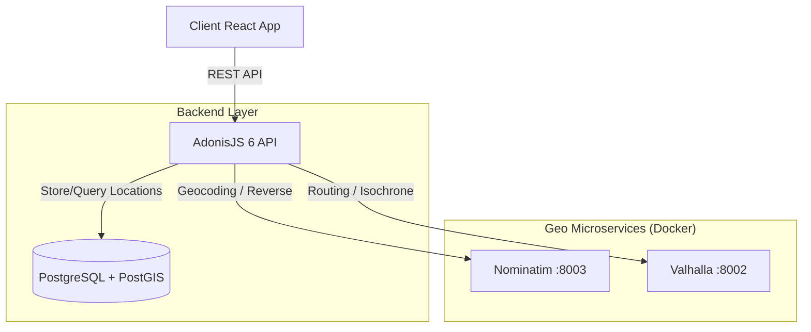

# Guide d'Implémentation : Gestion des Livraisons (AdonisJS 6 + PostGIS)

Ce document décrit l'architecture et les étapes pour implémenter la gestion des livraisons avec un backend **AdonisJS 6**, une base de données **PostgreSQL + PostGIS**, et les micro-services géographiques locaux (**Nominatim**, **Valhalla**).

## 🏗️ Architecture Globale

Le backend AdonisJS agit comme le chef d'orchestre. Il sécurise les appels aux services géographiques, persiste les données dans PostGIS, et expose une API propre au frontend React.



## 🚀 1. Configuration du Projet AdonisJS

### A. Installation de PostGIS
Assurez-vous que l'extension PostGIS est activée sur votre base de données.
*Dans votre migration initiale ou migration dédiée :*

```typescript
import { BaseSchema } from '@adonisjs/lucid/schema'

export default class extends BaseSchema {
  public async up() {
    await this.db.rawQuery('CREATE EXTENSION IF NOT EXISTS postgis')
  }
}
```

### B. Configuration des Services (`env.ts` & `config/services.ts`)
Ajoutez les URLs des services géographiques dans votre fichier `.env`.

```env
GEO_NOMINATIM_URL=http://localhost:8003
GEO_VALHALLA_URL=http://localhost:8002
```

## 🗺️ 2. Gestion des Coordonnées (Géométrie)

Pour gérer les points GPS, il est recommandé d'utiliser les types géométriques de PostGIS.

### Migration ("deliveries")
```typescript
import { BaseSchema } from '@adonisjs/lucid/schema'

export default class extends BaseSchema {
  protected tableName = 'deliveries'

  public async up() {
    this.schema.createTable(this.tableName, (table) => {
      table.increments('id')
      table.integer('order_id').unsigned().references('orders.id')
      table.string('address_full')
      
      // Stockage de la position (Latitude/Longitude)
      // Utilisation du type GEOMETRY(Point, 4326)
      table.specificType('location', 'geometry(Point, 4326)').notNullable()
      
      table.decimal('delivery_fee', 10, 2)
      table.string('status').defaultTo('pending')
      table.timestamp('created_at')
      table.timestamp('updated_at')
    })
  }
}
```

## 🚚 3. Service Géographique (Adonis)

Créez un service `app/services/geo_service.ts` pour encapsuler la logique Valhalla/Nominatim.

```typescript
import env from '#start/env'
import axios from 'axios'

export class GeoService {
  private nominatimUrl = env.get('GEO_NOMINATIM_URL')
  private valhallaUrl = env.get('GEO_VALHALLA_URL')

  // 1. Géocodage via Nominatim
  async geocode(address: string) {
    const response = await axios.get(`${this.nominatimUrl}/search`, {
      params: { q: address, format: 'json', limit: 1 }
    })
    if (!response.data[0]) return null
    
    return {
      lat: parseFloat(response.data[0].lat),
      lon: parseFloat(response.data[0].lon),
      display_name: response.data[0].display_name
    }
  }

  // 2. Calcul de Distance/Route via Valhalla
  async calculateRoute(start: { lat: number, lon: number }, end: { lat: number, lon: number }) {
    const json = {
      locations: [
        { lat: start.lat, lon: start.lon },
        { lat: end.lat, lon: end.lon }
      ],
      costing: 'auto',
      units: 'km'
    }

    try {
      const response = await axios.get(`${this.valhallaUrl}/route`, {
        params: { json: JSON.stringify(json) }
      })
      
      const summary = response.data.trip.summary
      return {
        distanceKm: summary.length,
        timeSeconds: summary.time,
        shape: response.data.trip.legs[0].shape // Polyligne encodée pour la carte
      }
    } catch (error) {
      console.error('Valhalla Error', error)
      return null
    }
  }
}

export const geoService = new GeoService()
```

## 🎮 4. Controller & Logique Métier

Exemple de `DeliveryController` qui gère l'estimation et la création de livraison.

```typescript
// app/controllers/deliveries_controller.ts
import type { HttpContext } from '@adonisjs/core/http'
import { geoService } from '#services/geo_service'
import Order from '#models/order'
import db from '@adonisjs/lucid/services/db'

export default class DeliveriesController {

  // POST /deliveries/estimate
  public async estimate({ request, response }: HttpContext) {
    const { address, cartTotal } = request.all()
    
    // 1. Géocodage de l'adresse client
    const location = await geoService.geocode(address)
    if (!location) {
      return response.badRequest({ message: 'Adresse introuvable' })
    }

    // 2. Calcul distance Entrepôt (Coordonnées fixes ou depuis DB) -> Client
    const WAREHOUSE_LOC = { lat: 5.3600, lon: -4.0083 } // Exemple Abidjan
    const route = await geoService.calculateRoute(WAREHOUSE_LOC, location)
    
    if (!route) return response.internalServerError('Erreur calcul itinéraire')

    // 3. Règle Métier : Calcul Frais
    let fee = 1000 + (route.distanceKm * 100) // 1000F base + 100F/km
    if (cartTotal > 50000) fee = 0 // Gratuit si > 50.000F

    return response.ok({
      fee,
      distance: route.distanceKm,
      time: route.timeSeconds,
      location: location // Pour afficher sur la carte frontend
    })
  }

  // POST /deliveries/create
  public async create({ request, response }: HttpContext) {
    // Création de la livraison avec insertion spatiale (ST_SetSRID(ST_MakePoint(lon, lat), 4326))
    // Nécessite Query Builder raw pour PostGIS ou gestion via un Adapter
    
    const { orderId, lat, lon, address } = request.all()
    
    await db.rawQuery(
      `INSERT INTO deliveries (order_id, address_full, location, created_at) 
       VALUES (?, ?, ST_SetSRID(ST_MakePoint(?, ?), 4326), NOW())`,
      [orderId, address, lon, lat] // Attention ordre : Lon, Lat pour PostGIS
    )
    
    return response.created({ message: 'Livraison planifiée avec succès' })
  }
}
```

## � 5. Requêtes Spatiales (Exemples)

Retrouvez les livraisons dans un rayon de 5km :

```typescript
const nearbyDeliveries = await db.rawQuery(
  `SELECT id, address_full, ST_AsText(location) as loc 
   FROM deliveries 
   WHERE ST_DWithin(
     location, 
     ST_SetSRID(ST_MakePoint(?, ?), 4326), 
     5000 // 5000 mètres
   )`,
  [driverLon, driverLat]
)
```

## 📱 Côté Frontend (Adapté)

Le frontend ne parle plus directement à Nominatim/Valhalla. Il appelle votre API Adonis.

1.  **Autocomplete** : Appelle `GET /api/locations/search?q=...` -> Adonis -> Nominatim.
2.  **Estimation** : Appelle `POST /api/deliveries/estimate` avec l'adresse choisie.
3.  **Validation** : Appelle `POST /orders` (qui déclenche la création de livraison).

Cela sécurise votre clé API (si vous passez plus tard sur Google Maps) et centralise la logique de tarification.
